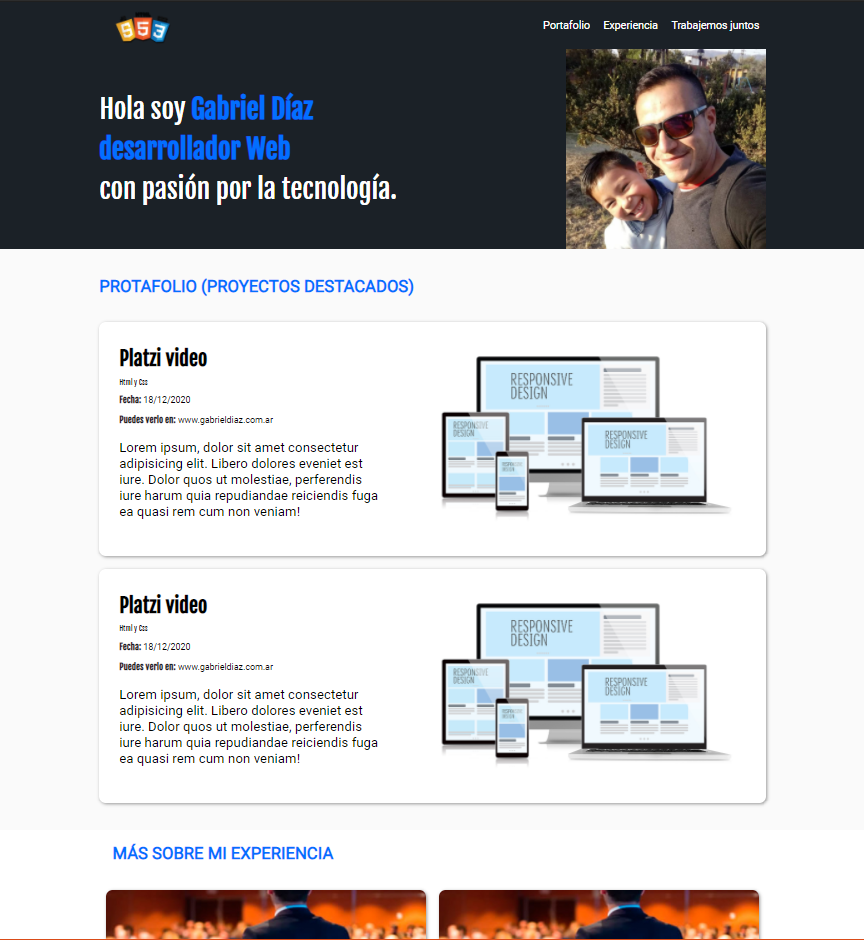

# Platzi-Diseño-web-oneline
Proyecto para practicar durante el curso de Desarrollo Web oneline de Platzi.
En éste caso desarrollamos un portfolio personal utilizando los elementos html y css más utilizados.

> 

###### [Contáctame](https://www.instagram.com/gabriel.diaz_arg/?hl=es-la)
