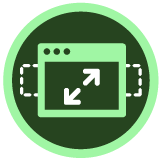
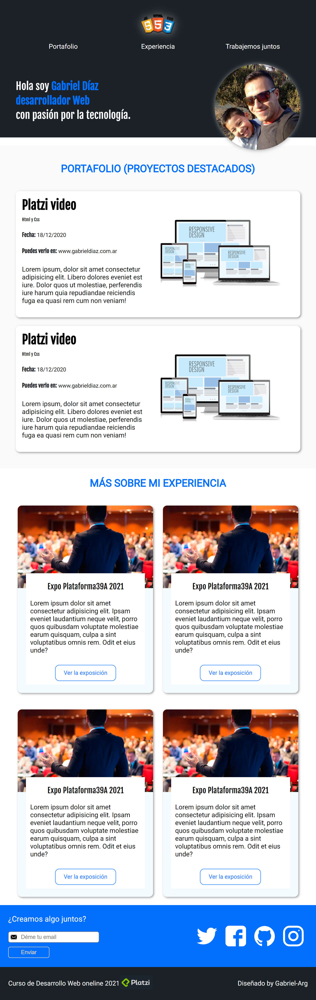

# Platzi-Diseño-web-oneline
Proyecto creado para practicar y aplicar todo lo aprendido durante los cursos de Desarrollo Web oneline y Responsive Design de Platzi.
En éste caso desarrollamos un portfolio personal utilizando los elementos html y css más habituales.
Además la página web logra adaptarse a los diferentes viewport de los dispositivos más utilizados (Pc, desktop, tablet y celular)

 

> 

## [Contáctame](https://www.instagram.com/gabriel.diaz_arg/?hl=es-la)
